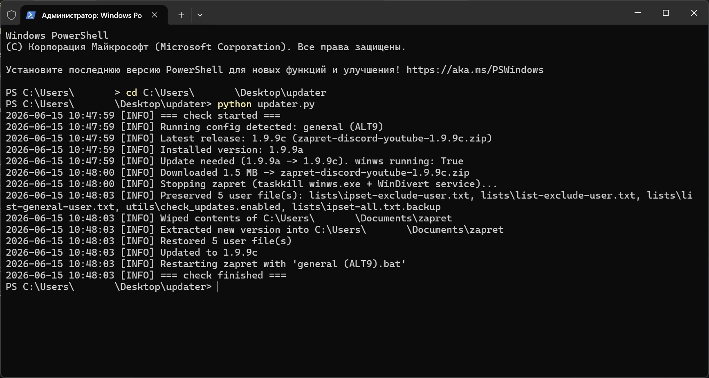

# Автообновлятор для zapret-discord-youtube

[](https://github.com/fosterion/zapret-updater/actions/workflows/tests.yml)

При входе в систему и раз в час (через Планировщик задач Windows) проверяет [Flowseal/zapret-discord-youtube](https://github.com/Flowseal/zapret-discord-youtube)
и при выходе новой версии сам её ставит: останавливает запущенный zapret, стирает старую папку, распаковывает свежий релиз и запускает тот же конфиг, что работал.

## Пример работы

Один прогон, когда вышла новая версия — апдейтер сам прошёл весь цикл
`1.9.9a → 1.9.9c` и перезапустил тот же конфиг:



## Файлы

| Файл | Назначение |
|------|-----------|
| `updater.py` | Сама логика. Один запуск = одна проверка-и-обновление. |
| `config.example.json` | Шаблон настроек. Скопируй в `config.json` и поправь под себя. |
| `config.json` | Твои настройки (путь к zapret и т.д.). Не в репозитории — личный. |
| `install_task.ps1` | Копирует файлы в постоянную папку рядом с zapret и регистрирует задачу. |
| `uninstall_task.ps1` | Удаляет задачу. |
| `tests/` | Юнит-тесты (`unittest`, без зависимостей). |
| `state.json` | Создаётся автоматически: последний запущенный конфиг + версия/время апдейта. |
| `updater.log` | Лог работы. |
| `updater.lock` | Создаётся автоматически: блокировка от параллельных запусков. |

## Как это работает

1. Берёт последнюю версию из `.service/version.txt` репозитория (как делает сам zapret — без GitHub API, без токена, без лимитов).
2. Читает установленную версию из `service.bat` (`LOCAL_VERSION`).
3. Если версии совпадают — выходит. Если нет:
   - запоминает, какой `general*.bat` сейчас работает (по заголовку окна `zapret: ...`);
   - качает `zapret-discord-youtube-<версия>.zip`;
   - убивает `winws.exe` и снимает службу `WinDivert` (graceful shutdown у него нет);
   - **сохраняет** пользовательские файлы (`lists/*-user.txt`, `utils/*.enabled`), чистит папку, распаковывает новый архив, возвращает сохранённые файлы;
   - перезапускает тот же `.bat`, что работал до обновления.

Параллельные запуски исключены: каждый процесс берёт single-instance lock
(`updater.lock`), и если предыдущая проверка ещё идёт — новая молча пропускается.

## Установка

1. Создай конфиг из шаблона и укажи свой путь:

   ```powershell
   Copy-Item config.example.json config.json
   ```

   В `config.json` главное — `install_path` (полный путь к твоей папке zapret, напр. `C:\...\zapret`).
2. Открой **PowerShell от имени администратора** в этой папке и выполни:

   ```powershell
   powershell -ExecutionPolicy Bypass -File .\install_task.ps1
   ```

   Скрипт **скопирует** `updater.py`, `config.json` и `uninstall_task.ps1` в постоянную
   папку — соседнюю с zapret (`C:\...\zapret` → `C:\...\zapret-updater`) — и
   зарегистрирует задачу с путями уже на эту копию. **После этого склонированный репозиторий
   можно удалить** — апдейтер работает из установленной папки. Другое место установки:
   `-InstallDir "D:\path\zapret-updater"`.

   Задача срабатывает при входе в систему и затем каждый час, запускается через
   `pythonw.exe` (без окна консоли) и не стартует второй раз, пока крутится
   предыдущий запуск. Права администратора нужны, чтобы `winws.exe` мог грузить
   драйвер WinDivert без запроса UAC.

3. Проверка прямо сейчас (лог уже в установленной папке):

   ```powershell
   Start-ScheduledTask -TaskName ZapretAutoUpdater
   Get-Content "C:\...\zapret-updater\updater.log" -Wait   # путь печатает установщик
   ```

## Ручной запуск

```powershell
python updater.py            # обычная проверка
python updater.py --force    # переустановить последнюю версию принудительно
python updater.py --config D:\other\config.json
```

> Запускать стоит из-под админа, если zapret в этот момент работает (нужно убить `winws.exe` и снять драйвер).

## Настройки (`config.json`)

| Ключ | Что значит |
|------|-----------|
| `install_path` | Папка, куда ставится zapret. **Обязательный.** |
| `preserve_globs` | Маски файлов, которые не стирать при обновлении. |
| `default_config` | Конфиг для перезапуска, если не удалось определить запущенный (напр. `"general"`). |
| `restart_after_update` | Перезапускать ли zapret после обновления. |

В конфиге — только то, что зависит от пользователя/машины. Привязка к репозиторию
(`REPO`, `VERSION_URL`, `ASSET_NAME_TEMPLATE`, таймаут) захардкожена константами в
начале `updater.py` — менять её нужно только при форке под другой проект.

## Удаление

Из установленной папки (`C:\...\zapret-updater`) сними задачу, затем при
желании удали саму папку:

```powershell
powershell -ExecutionPolicy Bypass -File .\uninstall_task.ps1
Remove-Item -Recurse -Force "C:\...\zapret-updater"
```

Сам zapret это не трогает — удаляются только автообновления.

## Защита от дурака

Перед стиранием папки скрипт проверяет, что в ней действительно zapret
(есть `service.bat`/`bin`/`general.bat`). Если `install_path` указывает не туда —
обновление прервётся с ошибкой, ничего не сотрётся.

## Тесты

```powershell
python -m unittest discover -s tests -v
```

Тесты герметичные (сеть и системные вызовы замоканы), на чистом `unittest` без
зависимостей. На каждый push в `main` и PR их прогоняет GitHub Actions
(`.github/workflows/tests.yml`, раннер `windows-latest` — код Windows-only).
